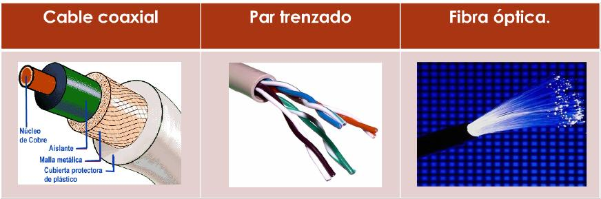

# 1.1. Introducción

Los **medios guiados** conducen (guían) las ondas a través de un camino físico, ejemplos de estos **medios** son el cable coaxial, la fibra óptica, el par sin trenzar y el par trenzado de los cuales explicaremos más en profundidad a continuación.

