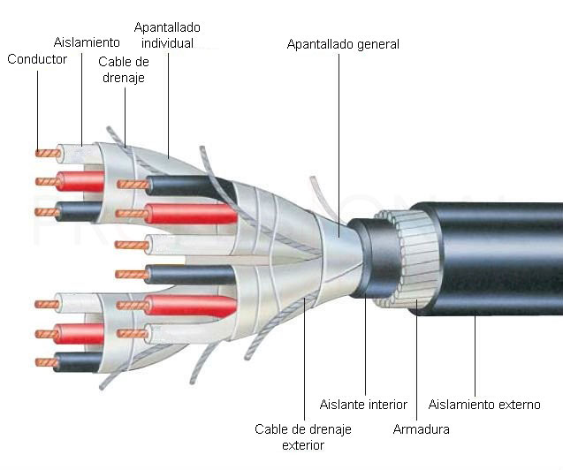

# 1.3. Cable de par trenzado

### <mark style="color:blue;">Introducción</mark>

**El cable par trenzado lleva con nosotros más de 100 años, concretamente desde 1881, pero a un nivel bastante inferior a lo que hoy día tenemos. Su precursor fue nada menos que Alexander Graham Bell, el inventor del teléfono y las primeras redes de comunicación por voz años antes.**

****

### <mark style="color:blue;">Construcción</mark>

**Como su propio nombre indica, el cable par trenzado consiste en pares de cables que se entrecruzan en forma de bucle en espiral. Cada conductor individual está fabricado en cobre o aluminio, recubierto de un aislante de plástico individual. Su denominación de pares trenzados es por el hecho de que cada cable contiene varios de estos pares en un encapsulado general, normalmente 4 para redes LAN.**

**En función de la categoría del cable, cada par trenzado puede presentar distintos encapsulados independientes para mejorar el aislamiento entre las distintas parejas:**


Documento escrito por: Pablo Perea Campos

