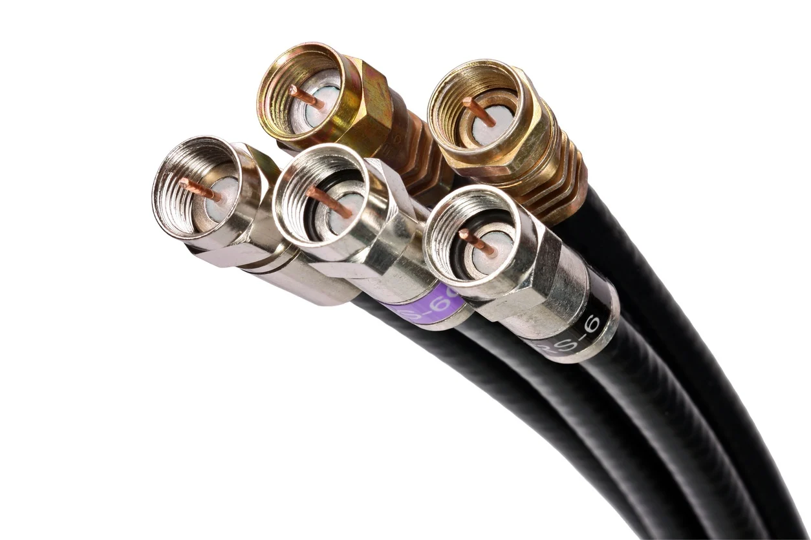

# 1.4. Cable coaxial


Es un cable de transmisión de datos que se compone de dos conductores que se orientan de forma coaxial y separados por una capa de aislamiento dieléctrico.


La estructura de un cable coaxial típico se basaría en un núcleo compuesto de un alambre de metal rodeado por un aislante llamado dieléctrico. Dicho aislamiento está protegido por una malla metálica (lámina o trenza) y todo el cable entero está envuelto en una cubierta externa protectora, resguardando así el cable de la humedad y las impurezas.

El cable coaxial se ha diseñado para transportar señales de alta frecuencia y para protegerlas frente a las interferencias electromagnéticas de fuentes externas. El uso más extendido es la televisión por cable, aunque también se usa en emisoras de radio, cerrados de televisión (CCTV), equipo de vídeo doméstico, de banda ancha, aplicaciones Ethernet y sistemas de cableado submarino.

### Conectores

