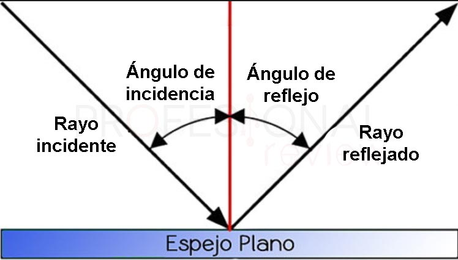
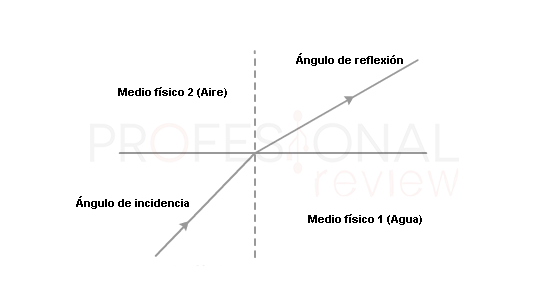
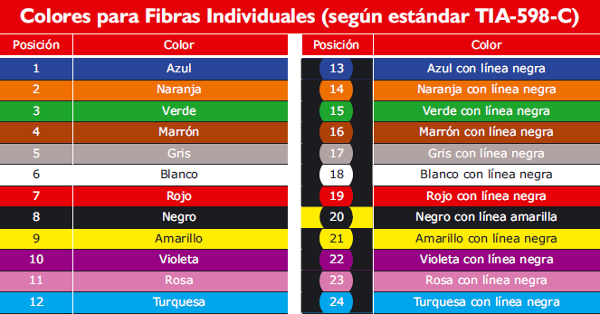
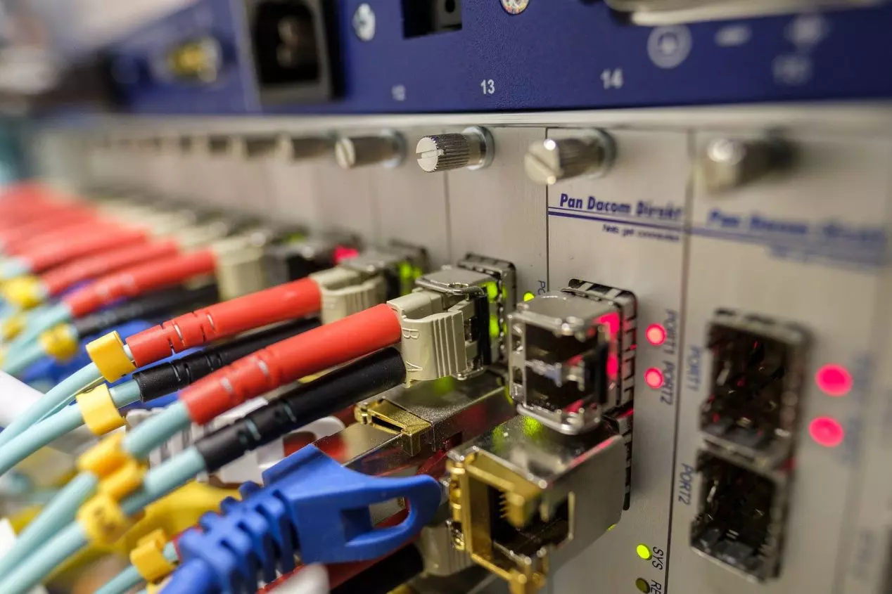
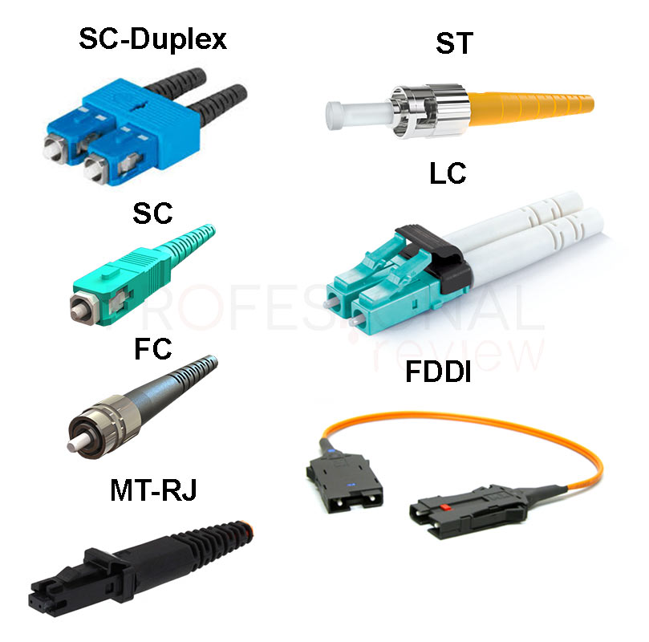
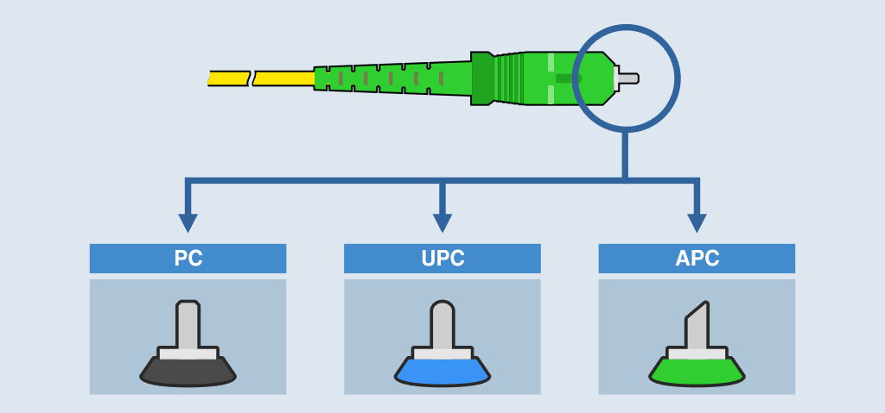

# 1.5. Fibra óptica


Autora: Alba García Salinas

Última modificación: 25/05/2022


### 1.5.1 ¿Qué es la fibra óptica?

Se trata de un **medio de transmisión de datos** mediante **impulsos fotoeléctricos** a través de un hilo construido en **vidrio transparente u otros materiales plásticos** con la misma funcionalidad. Estos hilos pueden llegar a ser casi tan finos como un pelo, y son precisamente el medio de transmisión de la señal.

Básicamente por estos finísimos cables se transfiere una **señal luminosa** desde un extremo del cable hasta el otro. Esta luz puede ser generada mediante un **láser o un LED**, y su uso más extendido es el de **transportar datos a grandes distancias**, ya que este medio tiene un **ancho de banda mucho mayor que los cables metálicos**, **menores pérdidas y a mayores velocidades de trasmisión.**

Otro aspecto muy importante que debemos tener en cuenta, es que la fibra óptica es **inmune a las interferencias electromagnéticas**, que es algo que por ejemplo los cables de pares trenzados sufren en todos los casos y contribuyen a que se necesiten repetidores cada cierta distancia. Debemos saber que la fibra óptica **no transporta energía eléctrica**, solamente señales de luz.

Pero la fibra óptica no solamente se utiliza para la transmisión de datos en redes, sino también para **conexiones de audio** de alta calidad. Además, también es una **fuente de iluminación** para proporcionar visibilidad en espacios reducidos e incluso para productos de decoración, por ejemplo, en árboles de navidad y cosas similares. Por supuesto estas fibras están construidas de plástico y son de bajo coste, y tienen poco que ver con los cables que se utiliza para datos.

### 1.5.2 Partes de un cable de fibra óptica

Antes de ver cómo funciona, creemos que es importante saber cuáles son las partes que constituyen un cable de fibra óptica.

Partes:

* **Núcleo**: Es el elemento central de un cable de fibra óptica que no siempre está presente. Su función es simplemente la de **proporcionar un refuerzo** para evitar la rotura y deformación del cable.
* **Drenaje de humedad**: Este elemento tampoco está presente en todos los cables. Su función es la de **conducir posible humedad** que tenga el cable p**ara que salga a través de él**. Va enrollado en el núcleo.
* **Hilos de fibra**: es el elemento conductor, por ellos **viaja la luz y los datos en ella**. Están fabricados de **cristal de silicio** o **plástico de extrema calidad** que crean un medio en el que la luz pueda reflejarse y refractarse correctamente hasta llegar al destino.
* **Buffer y Cladding (revestimiento)**: básicamente es el recubrimiento de los hilos de fibra óptica. Consiste en un **relleno de gel** de capa oscura para evit**ar que los rayos de luz no se salgan de la fibra**. A su vez el buffer es el **recubrimiento externo** que contiene el gel y la fibra.
* **Cinta de Mylar y capas aislantes**: básicamente es un recubrimiento aislante que recubre todos los buffers de fibra. En función del tipo de construcción tendrá varios elementos, todos ellos de **material dieléctrico** (no conductor).
* **Recubrimiento ignífugo**: si el cable es **resistente al fuego**, también necesitará un recubrimiento capaz de soportar las llamas.
* **Armadura**: la siguiente capa se trata de la armadura del cable, que en los de mayor calidad siempre están construida de **hilos de Kevlar**. Este material es liviano y de gran resistencia e ignífugo, lo podremos ver en chalecos antibala y cascos de pilotos.
* **Recubrimiento exterior:** como cualquier cable, se necesita un recubrimiento exterior, normalmente de plástico o PVC.

### 1.5.3 Cómo funciona la fibra óptica

Al ser cables por los que viaja una señal luminosa, el modo de trasmisión **no se basa en la transferencia de electrones** a través de un material conductor. En este caso atendemos a los fenómenos físicos de la **reflexión** y **refracción** de la luz.



La reflexión de un haz de luz se produce cuando **éste incide sobre una superficie de separación de dos medios y se produce el cambio de dirección de la onda** que la lleva a tomar una dirección con un ángulo igual al de incidencia. Por ejemplo, si el haz luminoso incide en un ángulo de 90 grados sobre una superficie, este rebotará en dirección contraria, esto es lo que pasa cuando nos colocamos frente a un espejo. Si en otro caso el haz de luz incide sobre una superficie con 30 grados, el haz saldrá rebotado con esos mismo 30 grados.




En este caso es cuando **se produce un cambio de dirección y velocidad en una onda al pasar de un medio a otro.** Por ejemplo, es lo que vemos cuando la luz pasa del aire al agua, veremos la misma imagen, pero en un ángulo diferente.




### 1.5.4 Tipos de fibra óptica

#### 1.5.4.1 Según conexión

Monomodo

En la **fibra monomodo**, **solamente se transmite un haz luminoso** por el medio. Este haz será capaz de llegar, en el mejor de los casos hasta una **distancia de 400 Km** sin el uso de un repetidor, y **se utiliza un láser de alta intensidad** para generar este haz. Este haz es capaz de transportar hasta **10 Gbit/s por cada fibra**.

Multimodo

En la **fibra multimodo** en cambio, se puede transmitir **varias señales de luz por un mismo cable**, que son generadas por **LEDs de baja intensidad**. Se usa para transmisiones de más corto alcance, siendo además **más baratas y fáciles de instalar**.

#### 1.5.4.2 Según cable

Recubrimiento de la fibra óptica

* **Cable de fibra blindado**: este cable de fibra está orientado a entornos exteriores principalmente, permite que se pise por una persona y es anti-roedores, aunque es muy duro, tiene una gran flexibilidad.
* **Cable de fibra óptica que permite curvarlo**: normalmente los cables de fibra óptica no pueden doblarse. Este tipo de cable es resistente a daños y pérdidas relacionadas con la reflexión de la luz. Gracias al diseño del núcleo, podremos doblarlo sin que se rompa ni tengamos problemas. Gracias a esta característica, puede enrollarse y adaptarse perfectamente a las necesidades del rack donde lo instalemos.
* **Cable de fibra monomodo y multimodo**: este cable es híbrido, en la primera parte y la última tiene un diámetro correspondiente a las fibras monomodo, esto permite llegar más lejos en el cableado de fibra, así como mejorar la calidad de la señal de datos.
* **Cable de fibra de baja pérdida de inserción**: los conectores de los extremos están hechos para que la pérdida de señal por insertar la fibra en el conector sea mínima, reduciendo a 0,2dB para los conectores LC y SC que usamos habitualmente. En instalaciones donde la señal esté muy al límite, este tipo de cables de fibra serán necesarios.
* **Cable de fibra conmutable**: permite cambiar el sentido de la fibra de manera fácil, sin realizar complicadas operaciones, esto es ideal para en entornos de alta densidad donde tengamos que cambiar muchas fibras. No es necesario herramientas especiales, ni cambiar el conector de fibra entero. Este tipo de fibras se usa habitualmente en redes con continuos cambios, porque tiene una gran versatilidad.
* **Cable de conexión Uniboot**: este tipo de cables integran dos fibras en un solo cable, con conectores LC. Esto es ideal en entornos de alta densidad de cables como en un rack de un datacenter, donde tengamos cientos de puertos que usar. Reduce la cantidad de cables en un 50%, porque tenemos 2 fibras en un solo cable, ideal para espacios reducidos.

### 1.5.5 Modo de transmisión

Dependiendo del entorno de uso de la fibra óptica, se puede conseguir una comunicación Dúplex o Full-Dúplex utilizando multiplexación por división de onda. En el caso de la fibra óptica, tendremos una longitud de onda específica para la subida de datos, y otra longitud de onda para la descarga de datos, de esta forma, podremos subir y descargar datos simultáneamente.

En el caso de la fibra óptica con la que interconectar switches, la comunicación es simplex, es decir, en una dirección únicamente. Cada cable de fibra en modo simplex tendrá un conector a cada lado, pero solamente tendremos comunicación de descarga o subida. Para lograr una comunicación Duplex, lo que se hace es tener dos cables de fibra y un conector por cada cable, de esta forma, tendremos comunicación bidireccional. Normalmente estos cables de fibra están marcados como «A» y «B» tal y como aparecen en la foto anterior, además, pueden usar cubiertas de diferente color para diferenciarlos fácilmente.

### 1.5.6 Tipos de conectores

En cuanto a tipos de conectores de fibra óptica, podremos encontrar los siguientes:

* **SC**: Este conector es el que con mayor frecuencia veremos, ya que se utiliza para la **transmisión de datos** en conexiones de fibra monomodo. También existe una versión **SC-Duplex** que básicamente son dos SC unidos.
* **FC**: este es otro de los más utilizados y tienen un aspecto similar a un conector de antena coaxial.
* **ST**: también es similar al anterior con un elemento central de unos 2,5 mm el cual está más expuesto.
* **LC**: en este caso el conector es cuadrado, aunque se mantiene el elemento central de igual configuración que los dos anteriores.
* **FDDI**: es un conector de **fibra dúplex**, es decir, conecta dos cables en lugar de uno.
* **MT-RJ**: También es un conector dúplex y no se suele utilizar para fibras monomodo.

|      Tipo de fibra      | Color del conector |   |
| :---------------------: | :----------------: | - |
|         62.5/125        |        Beige       |   |
|          50/125         |        Negro       |   |
|  50/125 laser optimized |     Aguamarina     |   |
|           OM5           |        Lima        |   |
|         Monomodo        |        Azul        |   |
| Monomodo con pulido APC |        Verde       |   |

### 1.5.7 Tipos de pulido



Contacto Físico (_Physical Contact_). El ferrule está biselado y rematado en una superficie plana. Esto evita espacios vacíos entre los ferrules de los conectores que se están acoplando y logra unas pérdidas de retorno entre los -30 dB y los -40 dB. Se trata de una solución cada vez más en desuso



Ultra Contacto Físico (_Ultra Physical Contact_). Similares a los PC, pero logran reducir las pérdidas de retorno a un margen entre los -40 y los -55 dB gracias a que el bisel tiene una curva más pronunciada. La tendencia actual es utilizarlo en líneas muertas para que los operadores de telecomunicaciones lleven a cabo pruebas de red por ejemplo con OTDR.



Contacto Físico en Ángulo (_Angled Physical Contact_). El ferrule termina en una superficie plana y a su vez inclinada 8 grados. Se trata del conector que logra un enlace óptico de mayor calidad ya que consigue reducir las pérdidas de retorno hasta los -60 dB aumentando así el número de usuarios en fibras monomodo. Por este motivo, unido a sus cada vez menores costes de fabricación, APC se ha convertido en el tipo de pulido más utilizado.



### Conclusiones, ventajas y desventajas

Con esta información podemos formarnos una idea bastante genérica y completa sobre qué es la fibra óptica y cómo es la base de su funcionamiento. Las **conexiones domésticas de fibra óptica** son cada vez más comunes, aunque a veces en lugar de llegarnos directamente en fibra, nos llega en forma de **** cable coaxial si la red es híbrida. Aprovecharemos en otro artículo para hablar más largo y tendido sobre este tipo de cable.

Sin duda **el futuro que nos espera se sitúa claramente en redes de fibra óptica**, cada vez son más los núcleos de población relativamente pequeños que cuentan con este tipo de conectividad de **alto ancho de banda,** ya que esta es una de las principales ventajas. Además, al basarse en luz en lugar de energía eléctrica, **es totalmente inmune a interferencias**, y además tampoco las produce. De igual forma **soporta muy bien los cambios climáticos** y temperaturas y **es muy ligera**, al tratarse de elementos no metálicos.

Pero no todo es bueno en la fibra óptica, ya que una de las limitaciones es que **los cables deben ser de gran firmeza** y estar muy bien protegidos, para evitar la rotura de la fibra. **Tampoco podemos transmitir electricidad**, esto es lógico, así que todo elemento que necesite energía eléctrica, deberá tener una fuente de alimentación cercana.

En cuanto a la instalación y empalme de cables de fibra, **es un proceso bastante complejo** y es necesaria gran precisión para que la señal se traslade de un cable a otro sin degradación de la señal. Los aparatos de transmisión y recepción también son **mucho más caros y complejos**, y en la mayoría de ocasiones se necesitan aparatos de conversión entre energía eléctrica y luminosa para que llegue a nuestros hogares.

Esto es todo acerca de las conexiones y cables de fibra óptica. Confiamos en que hayamos podido solucionarte las dudas que tenías acerca de esta tecnología y su uso.
