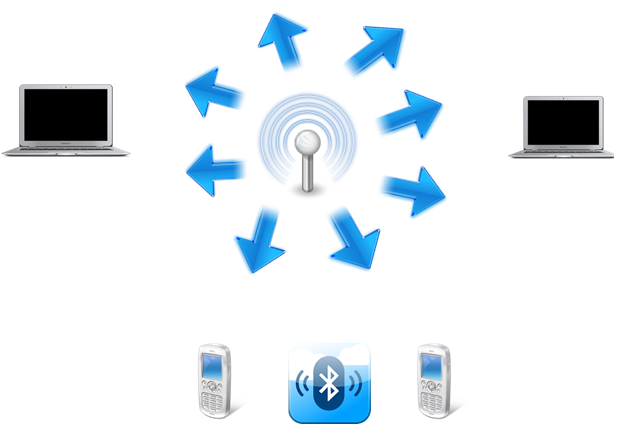

# 2.1. Introducción


Autora: Alba García Salinas

Última modificación: 25/05/2022


Los medios de transmisión no guiados son los que no confinan las señales mediante ningún tipo de cable, sino que las señales se propagan libremente a través del medio. Entre los medios más importantes se encuentran el aire y el vacío. Tanto la transmisión como la recepción de información se lleva a cabo mediante antenas. A la hora de transmitir, la antena irradia energía electromagnética en el medio. Por el contrario en la recepción la antena capta las ondas electromagnéticas del medio que la rodea. La configuración para las transmisiones no guiadas puede ser direccional y omnidireccional.

