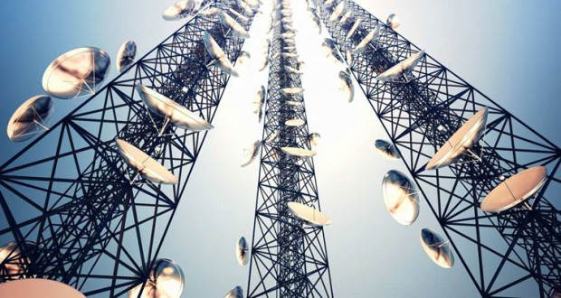

# 2.2. Radiotransmisión

### ¿Cómo funciona?

Consiste en la emisión/recepción de una señal de radio, por lo tanto el emisor y el receptor deben sintonizar la misma frecuencia.&#x20;

### Características

La emisión puede traspasar muros y no es necesario la visión directa de emisor y receptor.&#x20;

Son fáciles de generar, pueden viajar distancias largas y penetrar edificios.

La velocidad de transmisión suele ser baja 4800 Kbits/seg.&#x20;

Se debe tener cuidado con las interferencias de otras señales.

### Tipos

* LF (frecuencia baja) 30-300 KHz
* MF (frecuencia media) 300-3.000 KHz
* HF (frecuencia alta) 3-30 MHz
* VHF (frecuencia muy alta) 30-300 MHz
* UHF (frecuencia ultra alta) 300-3.000 MHz
* SHF (frecuencia super alta) 3-30 GHz
* EHF (frecuencia extremadamente alta) 30-300 GHz

Para la transmisión de datos hay dos tipos:

* Ondas radio de banda estrecha: El usuario ajusta el emisor-receptor a una frecuencia dada. El alcance de la difusión es de 1.650 m2 . Como la frecuencia es elevada no puede traspasar paredes de acero o los muros maestros.
* Onda radio de espectro expandido: transmite las señales dentro de un rango de frecuencias. La velocidades puede estar comprendida entre 250 Kbps y 2 Mbps. Distancias entre 130 metros en interiores y hasta 3200 m en exteriores.
