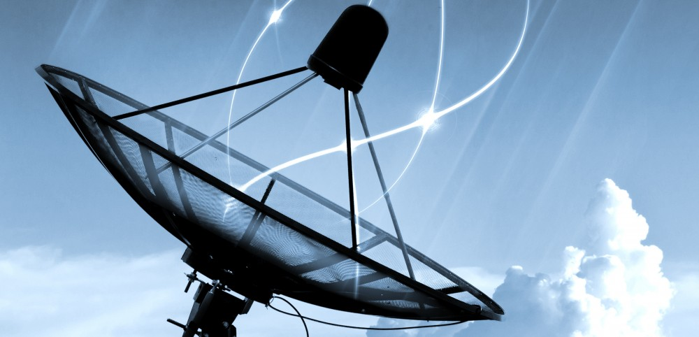

# Medios de Comunicación Guiados y No Guiados

### Equipo 3

### Autores y autoras:

* Juan Pérez
* Pablo Perea
* Jorge Escribano
* Alba García

<mark style="background-color:blue;">Fecha: Mayo de 2022.</mark>

Las tecnologías actuales de transmisión usan ondas electromagnéticas o pulsos de luz. En el caso de los medios guiados los datos se conducen a través de cables o “alambres”. En los medios inalámbricos, se utiliza el aire como medio de transmisión, a través de radiofrecuencias, microondas y luz (infrarrojos, láser); por ejemplo: puerto IrDA (_Infrared Data Association_), Bluetooth o Wi-Fi.

